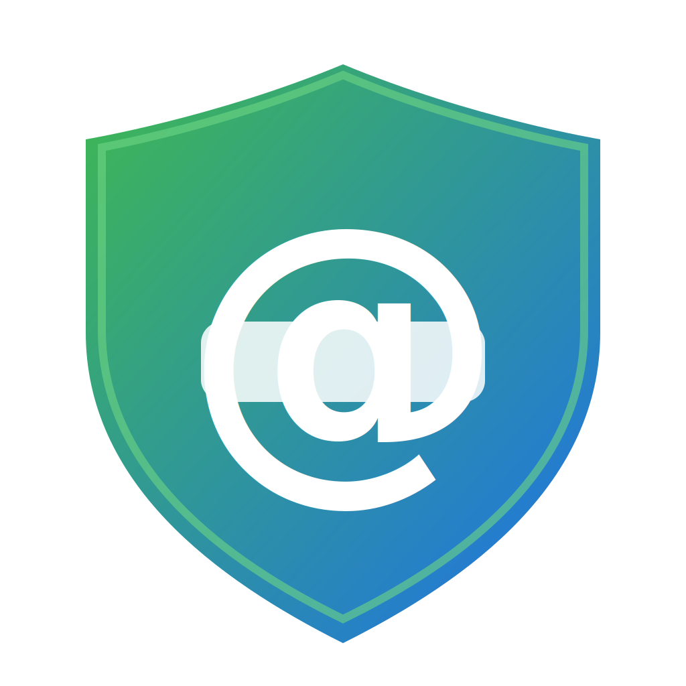
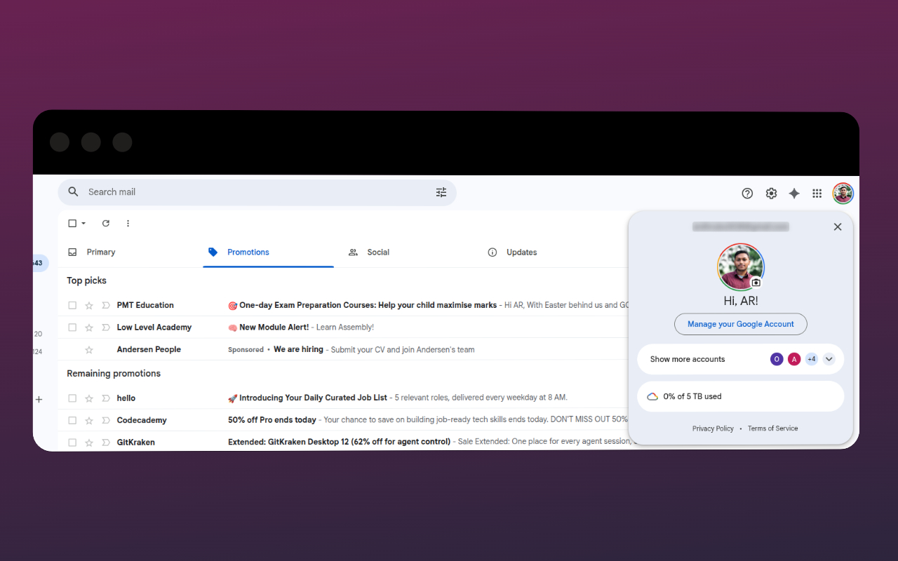
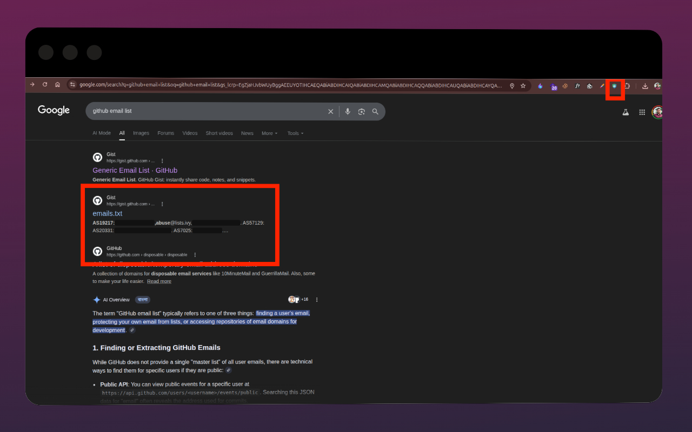

  
  <h1>Email Blurrer</h1>
  
<b>Never accidentally leak your email on a screen recording again.</b>

  

    
    
    
  

 

Have you ever been recording a tutorial, leading a team meeting, or sharing your screen, only to accidentally hover over your profile picture and expose your personal email to the entire universe? Yeah, we've been there. The slight panic. The rush to find the blur tool in your video editor.

**Fear no more.**

**Email Blurrer** is a sleek, modern, and slightly over-engineered Chrome extension built specifically to protect your privacy. It finds emails anywhere on the page—even those hidden in attributes or loaded dynamically—and cloaks them in glorious, unreadable obscurity.

  
  

---

## 🎯 Key Features
*   **Multiple Masking Styles:** Choose how you want to hide emails:
    *   **Blur:** A classic, adjustable blur effect.
    *   **Invisible:** Hides the email completely.
    *   **Redact:** Covers the email with a solid black bar.
*   **🛡️ Safe Mode for Screen Recording:** A high-priority toggle that forces a strong, non-interactive redaction to prevent accidental email exposure during recordings or presentations.
*   **🔎 Reveal on Hover:** A convenient option to quickly unmask an email just by hovering your mouse over it.
*   **⚡ Hotkey Support:** Toggle protection on and off with a quick keyboard shortcut (`Alt+Shift+H` on Windows/Linux, `Ctrl+Shift+H` on Mac).
*   **Dynamic Content Support:** The extension actively watches for emails that are loaded dynamically on a page, ensuring they get masked automatically.
*   **Deep Attribute Scanning:** Catches emails hidden in HTML attributes like `title`, `aria-label`, and `placeholder`.

---

## Installation

You can install the extension in two ways:

### From the Chrome Web Store (Recommended)

The easiest way to get started is to install Email Blurrer directly from the Chrome Web Store.

*(Link to be added once the extension is published)*

### Manually (for Developers)

If you want to run the latest version from the source code:

1.  Download the latest release `.zip` file from the [**Releases**](https://github.com/ardhrubo/email-blurrer/releases) page.
2.  Unzip the file.
3.  Open Chrome and navigate to `chrome://extensions`.
4.  Enable **"Developer mode"** using the toggle in the top-right corner.
5.  Click **"Load unpacked"** and select the unzipped folder.
6.  Pin the extension to your toolbar for easy access!

---

## ⚙️ How It Works

The extension uses a `MutationObserver` to watch for changes in the document and scan for emails. It's built with modern web technologies and designed to be as performant as possible.

-   **`content/masking.js`**: The core logic for finding and masking emails in text nodes and attributes.
-   **`content/runtime.js`**: Manages the extension's state and communication between the popup and content scripts.
-   **`manifest.json`**: Defines the extension's permissions and capabilities, following the MV3 standard.
-   **`popup/ui.js`**: Powers the interactive popup interface.

---

## 📜 License

This project is open source and available under the [MIT License](LICENSE).

*If this extension has saved you from an embarrassing moment, give the repo a star!* 😉

---

## ✨ Why You Need This
* 🦅 **It's 100% Open Source and Free:** No subscription fees. No ads. No stealing your data. Just pure, unadulterated privacy tech for the people.
* 🛡️ **Safe Mode for Screen Recordings:** Engage "Safe Mode" and we slap a solid black redaction bar over all emails. Hovering won't unmask it. The CIA couldn't unmask it. You're safe.
* 🔎 **Deep Anti-Scraping Tech:** We don't just blur plain text. We pierce right through Web Component Shadow DOMs and intercept sneaky invisible zero-width spaces (`\u200B` looking at you, Google account popups).
* ⚡ **Ninja Hotkey:** Type `Alt+Shift+H` (or `MacCtrl+Shift+H` on Mac) to toggle protection in less time than it takes to blink.

---

## 🚀 Installation

Since we're indie and open source, you won't find us hunting for your wallet on the Chrome Web Store. Instead, follow these three simple steps to unlock ultimate power:

1. Open Chrome and head to `chrome://extensions`
2. Flick that ultra-cool **Developer mode** switch in the top right corner.
3. Click **Load unpacked** and select this project folder.
4. *(Optional but recommended)* Pin the extension to your toolbar so you can gaze at its beautiful icon.

---

## 🛠️ How It Works (For the Nerds)

The extension is modular and watches your active document using a highly optimized `MutationObserver` operating strictly in `document_idle`. 

- **`content/masking.js`**: Home to the deep-DOM regex scanner. It rips through text nodes, attributes (`aria-label`, `title`), and iframes to execute the masking.
- **`content/runtime.js`**: The brains of the operation orchestrates dynamically loaded changes and injects our robust CSS blocks.
- **`manifest.json`**: Uses MV3 principles, injecting safely into cross-origin iframes (because iframes are sneaky).
- **`popup/ui.js`**: Powers the premium dark-mode interface where you flip the switches.

---

## ⚖️ Pricing & License

**Cost:** $0.00 forever.  
**License:** Open Source. Use it, fork it, break it, fix it, send a PR. 

*If this saved your job or your YouTube video, give the repo a star. Or don't. We're not your boss.* 😉