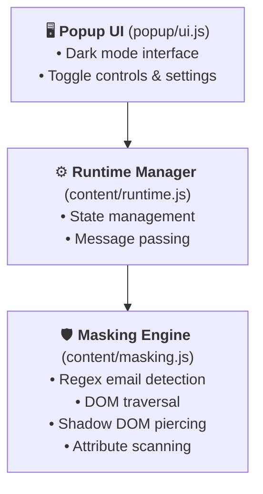

  
  <h1>Email Blurrer</h1>
  
<b>Your Personal Email Bodyguard for the Web</b>

  

    
    
    
    
    
  

  

    
    
    
  

## 🎬 The Problem

Have you ever been recording a tutorial, leading a team meeting, or sharing your screen, only to accidentally hover over your profile picture and expose your personal email to the entire universe? 

Yeah, we've been there. The slight panic. The rush to find the blur tool in your video editor. 😅

**Don't Worry, You have the solution now**

## 🛡️ The Solution

**Email Blurrer** is a sleek, modern, and slightly over-engineered browser extension built specifically to protect your privacy. It finds emails anywhere on the page—even those hidden in attributes or loaded dynamically—and cloaks them in glorious, unreadable obscurity.

  
  

## 🎯 Key Features

| Feature | Description |
|---------|-------------|
| 🎭 **Multiple Masking Styles** | **Blur** (adjustable), **Invisible** (completely hidden), or **Redact** (solid black bar) |
| 🛡️ **Safe Mode** | High-priority toggle for screen recordings. No hover reveal. The CIA couldn't unmask it. |
| 🔎 **Reveal on Hover** | Quickly unmask an email by hovering your mouse over it |
| ⚡ **Hotkey Support** | Toggle with `Alt+Shift+H` (Win/Linux) or `Ctrl+Shift+H` (Mac) |
| 🔄 **Dynamic Content** | Actively watches for emails loaded dynamically on the page |
| 🔍 **Deep Attribute Scanning** | Catches emails in `title`, `aria-label`, `placeholder`, and more |
| 🌐 **Cross-Browser** | Works on Chrome, Firefox, and Edge |
| 📦 **Lightweight** | Only 305KB - won't slow down your browser |

## 🚀 Installation

### **From Chrome Web Store** (Recommended) ⭐

👉 **[Install from Chrome Web Store](https://chromewebstore.google.com/detail/copippkpbpdkhjpcbaibpjdmaanccocc)**

*Firefox and Edge versions coming soon!*

### **Manual Installation** (from Releases)

1. Download the correct `.zip` file from [**Releases**](https://github.com/ardhrubo/email-blurrer/releases/latest)
   - `email-blurrer-chrome-vX.X.X.zip` for Chrome
   - `email-blurrer-firefox-vX.X.X.zip` for Firefox
   - `email-blurrer-edge-vX.X.X.zip` for Edge

2. Unzip the file to a permanent location on your computer

3. Load the unpacked extension:
   - **Chrome/Edge:** Go to `chrome://extensions` or `edge://extensions` → Enable **"Developer mode"** → Click **"Load unpacked"**
   - **Firefox:** Go to `about:debugging` → Click **"This Firefox"** → Click **"Load Temporary Add-on"**

4. Select the unzipped folder to load the extension

5. Pin the extension to your toolbar for easy access! 📌

## 🛠️ How It Works (For the Nerds)

The extension uses a highly optimized `MutationObserver` operating in `document_idle` mode to watch for DOM changes without impacting performance.

## 🏗️ Architecture

---

### Technical Breakdown:

| File | Purpose |
|------|---------|
| `content/masking.js` | Deep-DOM regex scanner. Rips through text nodes, attributes (`aria-label`, `title`), and iframes |
| `content/runtime.js` | The brains. Orchestrates dynamic changes and injects CSS blocks |
| `manifest.json` | MV3 principles, cross-origin iframe support (because iframes are sneaky) |
| `popup/ui.js` | Premium dark-mode interface where you flip the switches |

## ✨ Why You Need This

- 🦅 **100% Open Source and Free:** No subscription fees. No ads. No stealing your data. Just pure, unadulterated privacy tech for the people.
- 🛡️ **Safe Mode for Screen Recordings:** Engage "Safe Mode" and we slap a solid black redaction bar over all emails. Hovering won't unmask it. You're safe.
- 🔬 **Deep Anti-Scraping Tech:** We pierce right through Web Component Shadow DOMs and intercept sneaky invisible zero-width spaces (`\u200B` looking at you, Google account popups).
- ⚡ **Ninja Hotkey:** Toggle protection in less time than it takes to blink.

## 📊 Performance

| Metric | Value |
|--------|-------|
| Extension Size | 305 KB |
| Memory Usage | ~5 MB |
| CPU Impact | < 1% (idle mode) |
| Email Detection | < 50ms |

## 🔐 Privacy Promise

- ✅ **No data collection** - We don't track, store, or transmit your browsing data
- ✅ **No analytics** - Zero telemetry
- ✅ **No ads** - Never will be
- ✅ **No subscriptions** - Free forever
- ✅ **Open source** - Audit the code yourself

## ⚖️ Pricing & License

**Cost:** $0.00 forever.  
**License:** [MIT License](LICENSE) - Use it, fork it, break it, fix it, send a PR.

> *"If this saved your job or your YouTube video, give the repo a star. Or don't. We're not your boss."* 😉

## 🤝 Contributing

Contributions are welcome! Whether it's:
- 🐛 Bug reports
- 💡 Feature requests
- 🔧 Code improvements
- 📝 Documentation updates

Check out the [**Issues**](https://github.com/ardhrubo/email-blurrer/issues) page to get started.

## ☕ Support the Project

If you find this extension useful, please consider supporting its development. Every coffee helps!

  
<b>Built with ❤️ by <a href="https://github.com/ardhrubo">@ardhrubo</a></b>

  
<i>Protecting your privacy, one email at a time.</i>

  

    <a href="https://github.com/ardhrubo/email-blurrer">Give it a star if you liked it! ⭐</a>
  

